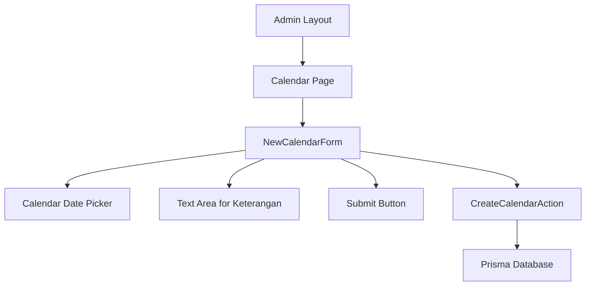
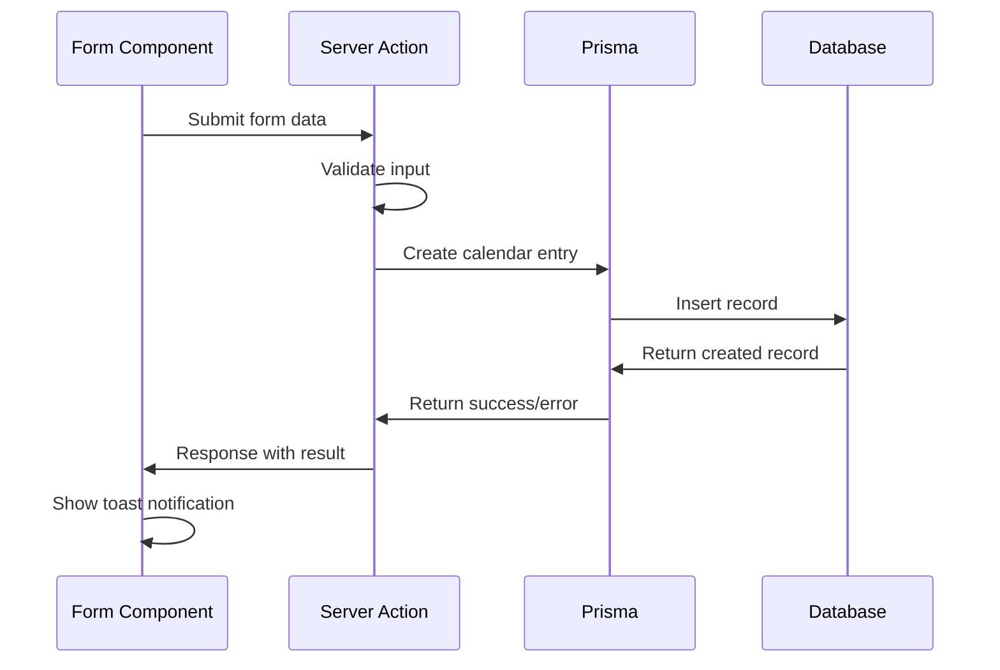
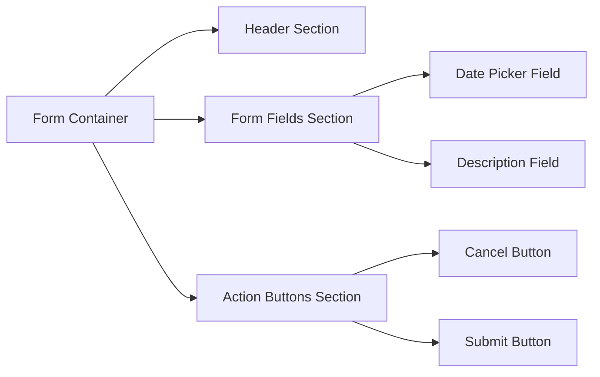

# New Calendar Form Design

## Overview

This design document outlines the implementation of a new calendar form feature for the admin panel. The form allows administrators to create calendar events based on the Kalender model from the Prisma schema. The feature will be implemented in the `admin/calendar/new-calendar` folder and follows established project patterns for form handling, validation, and server actions.

## Technology Stack & Dependencies

### Frontend Technologies
- **React 19** with Next.js 15.4.6 App Router
- **TypeScript** for type safety
- **React Hook Form 7.62.0** for form state management
- **Zod 4.0.17** for schema validation
- **@hookform/resolvers** for Zod integration
- **Radix UI** components for consistent design system
- **Tailwind CSS 4** for styling
- **Sonner** for toast notifications

### Backend Technologies
- **Next.js Server Actions** for form submission handling
- **Prisma ORM** for database operations
- **PostgreSQL** database

## Component Architecture

### Component Definition

The calendar form will consist of two main components:

1. **NewCalendarForm** - The main form component
2. **CreateCalendarAction** - Server action for form submission

### Component Hierarchy



### Props/State Management

#### NewCalendarForm Component Props
```typescript
interface NewCalendarFormProps {
  onSuccess?: () => void;
  onCancel?: () => void;
}
```

#### Form State Schema
```typescript
interface KalenderFormValues {
  tanggal: Date;
  keterangan?: string;
}
```

### Lifecycle Methods/Hooks

- **useForm** - React Hook Form for form state management
- **useState** - For loading states and UI interactions
- **useEffect** - For form initialization and cleanup

### Example of Component Usage

```tsx
<NewCalendarForm 
  onSuccess={() => router.push('/admin/calendar')}
  onCancel={() => router.back()}
/>
```

## Data Models & Schema

### Kalender Model Structure

Based on the Prisma schema, the Kalender model contains:

```typescript
interface Kalender {
  id: string;          // UUID, auto-generated
  createdAt: Date;     // Auto-generated timestamp
  updatedAt: Date;     // Auto-updated timestamp
  tanggal: Date;       // Required - Event date
  keterangan?: string; // Optional - Event description
}
```

### Form Validation Schema

```typescript
const kalenderSchema = z.object({
  tanggal: z.date({
    required_error: "Tanggal harus diisi",
    invalid_type_error: "Format tanggal tidak valid"
  }),
  keterangan: z.string()
    .max(500, "Keterangan tidak boleh lebih dari 500 karakter")
    .optional()
});
```

### Input/Output Interfaces

#### Create Input
```typescript
interface KalenderCreateInput {
  tanggal: Date;
  keterangan?: string;
}
```

#### Form Response
```typescript
interface FormResponse {
  success: boolean;
  message?: string;
  data?: Kalender;
  error?: string;
}
```

## API Integration Layer

### Server Action Structure

The server action will be implemented in `admin/calendar/new-calendar/actions/create-calendar.ts`:

```typescript
"use server";

export async function createCalendar(data: KalenderCreateInput): Promise<FormResponse>
```

### Request/Response Flow



### Authentication Requirements

- User must have `ADMIN` role
- Valid session required
- Middleware will handle route protection

## Business Logic Layer

### Form Submission Flow

1. **Input Validation**
   - Date field is required and must be valid
   - Description is optional but limited to 500 characters
   - Client-side validation with Zod schema

2. **Server Processing**
   - Validate user permissions
   - Sanitize input data
   - Create database record via Prisma
   - Log the action for audit purposes

3. **Response Handling**
   - Success: Show toast notification and redirect
   - Error: Display error message and maintain form state

### Calendar Event Types

The form will support creating various types of calendar events:
- Academic events (semester start/end)
- Exam schedules
- Holiday periods
- School activities
- Administrative deadlines

### Data Validation Rules

```typescript
const validationRules = {
  tanggal: {
    required: true,
    futureDate: false, // Allow past dates
    maxDate: new Date(2030, 11, 31)
  },
  keterangan: {
    required: false,
    maxLength: 500,
    allowHTML: false
  }
};
```

## UI Architecture & Styling

### Form Layout Structure



### Component Styling Strategy

- **Consistent Design System**: Uses established Radix UI components
- **Responsive Layout**: Mobile-first approach with Tailwind CSS
- **Form States**: Loading, error, and success visual indicators
- **Accessibility**: ARIA labels and keyboard navigation support

### UI Components Breakdown

#### Date Picker Component
- Uses `react-day-picker` for calendar interface
- Popover-based selection with button trigger
- Format: Indonesian locale (`dd/MM/yyyy`)
- Validation indicators for required field

#### Description Text Area
- Multi-line text input for event details
- Character counter (500 max)
- Auto-resize functionality
- Optional field with placeholder text

#### Action Buttons
- Primary button for form submission
- Secondary button for cancellation
- Loading states with disabled functionality
- Consistent with admin panel design

## File Structure & Organization

### Directory Layout

```
src/app/admin/calendar/new-calendar/
├── page.tsx                    # Main page component
├── _components/
│   └── new-calendar-form.tsx   # Form component
├── actions/
│   └── create-calendar.ts      # Server action
└── schema/
    └── calendar-schema.ts      # Validation schema
```

### Component File Organization

#### new-calendar-form.tsx
- Form component with React Hook Form integration
- Date picker and text area inputs
- Form validation and error handling
- Toast notifications for user feedback

#### create-calendar.ts
- Server action for database operations
- Input validation and sanitization
- Error handling and logging
- Cache revalidation for updated data

#### calendar-schema.ts
- Zod validation schema
- TypeScript interface definitions
- Reusable validation rules

## Testing Strategy

### Unit Testing Approach

1. **Form Component Tests**
   - Input validation scenarios
   - Form submission handling
   - Error state management
   - User interaction flows

2. **Server Action Tests**
   - Database operation validation
   - Input sanitization verification
   - Error handling coverage
   - Authentication checks

3. **Integration Tests**
   - End-to-end form submission
   - Database persistence verification
   - User role permission validation

### Test Coverage Areas

- Form validation with valid/invalid inputs
- Date picker functionality and constraints
- Character limit enforcement for description
- Server action success/failure scenarios
- Authentication and authorization flows

## Error Handling & Edge Cases

### Client-Side Error Handling

```typescript
const errorScenarios = {
  validation: "Display field-specific error messages",
  network: "Show retry option with error toast",
  permission: "Redirect to appropriate page",
  general: "Display generic error message"
};
```

### Server-Side Error Handling

- **Input Validation**: Return structured error responses
- **Database Errors**: Log errors and return user-friendly messages
- **Authentication**: Verify user permissions before processing
- **Rate Limiting**: Prevent spam submissions

### Edge Cases

1. **Date Selection**
   - Handle timezone differences
   - Validate date range constraints
   - Prevent duplicate date entries (if business rules require)

2. **Description Field**
   - Handle special characters and emojis
   - Prevent XSS attacks through input sanitization
   - Manage very long text inputs gracefully

3. **Network Issues**
   - Implement retry mechanisms
   - Preserve form state during failures
   - Provide offline capability indicators

## Performance Considerations

### Form Optimization

- **Debounced Validation**: Reduce validation calls during typing
- **Lazy Loading**: Load date picker components on demand
- **Form State Management**: Optimize re-renders with React Hook Form
- **Bundle Size**: Use tree-shaking for unused UI components

### Database Performance

- **Efficient Queries**: Use Prisma's optimized query generation
- **Connection Pooling**: Leverage existing Prisma connection management
- **Indexing**: Ensure proper database indexes for date queries

## Security Considerations

### Input Sanitization

```typescript
const securityMeasures = {
  xssProtection: "Sanitize all text inputs",
  sqlInjection: "Use Prisma ORM parameterized queries",
  csrfProtection: "Leverage Next.js built-in CSRF protection",
  rateLimit: "Implement submission rate limiting"
};
```

### Access Control

- **Role-Based Access**: Verify ADMIN role before form access
- **Session Validation**: Ensure valid authenticated session
- **Route Protection**: Use middleware for page-level security

## Integration Points

### Existing System Integration

1. **Admin Layout**: Inherits from existing admin layout structure
2. **Navigation**: Integrates with admin sidebar navigation
3. **Authentication**: Uses existing auth system and middleware
4. **Database**: Connects to existing Prisma setup
5. **UI Components**: Utilizes established design system

### Calendar Display Integration

- New calendar entries will appear in existing calendar views
- Events created will be visible in the academic calendar component
- Consistent styling with existing calendar event displays

## Deployment & Migration

### Database Considerations

- No new migrations required (Kalender model already exists)
- Existing table structure supports the form requirements
- No breaking changes to current schema

### Feature Rollout

1. **Development**: Implement and test in development environment
2. **Staging**: Deploy for admin user acceptance testing
3. **Production**: Deploy with feature flags for controlled rollout
4. **Monitoring**: Track form submission success rates and errors

### Configuration Requirements

- No additional environment variables needed
- Uses existing database connection and authentication setup
- Leverages current Next.js and Prisma configuration